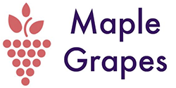

# 

Maple Grapes was our group's submission for Yale Hacks '17 [[Devpost](https://devpost.com/software/marble-grapes)].  It is a solution for predicting emerging technologies. Project was awarded 2nd place for the Informa Data Prediction Challenge. 

## Inspiration
Informa’s customers want to understand what new technologies will be most relevant to their businesses. This is also more “hype” around technologies. Therefore, it is increasingly important for companies to stay informed about emerging technologies.

## How we built it
* We developed a neural network to algorithmically predict the estimated “noise” of a technology.
* This information is then displayed in a dynamic dashboard for Informa’s market analysts.

## Accomplishments that we're proud of
Interviewing Informa, and understanding the problem in a deep way. We're also proud of developing a website that is intuitive to use.

## What's next for Maple Grapes
We'd like to improve the accuracy of the algorithm by increasing the body of historical data for technological successes and failures. We'd also to account for a social media impact score, by doing sentiment analysis.

## Team

# 