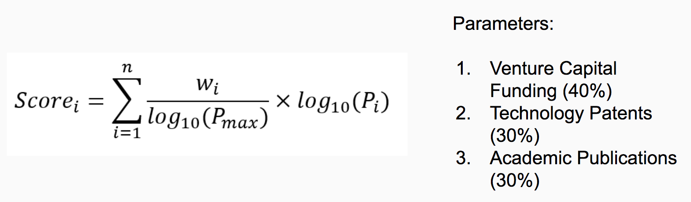

# 

Maple Grapes was our group's submission for Yale Hacks '17.  It is a data-driven solution for predicting emerging technologies. Project was awarded 2nd place for the Informa Data Prediction Challenge.


## Technical

* Problem: Informa’s customers want to understand what new technologies will be most relevant to their businesses.

* Solution: Using a neural network to algorithmically predict the estimated “noise” of a technology. This information is then displayed in a dynamic dashboard for Informa’s market analysts.

* Technologies: Express.JS, NodeJS, Chart.Js, NumPy

* Custom Algorithm: 

# 


## Installation

```
git clone [INSERT]
cd [HACAKTHON REPO]
cd express
npm start
```

The project should now be running on your localhost:3000

Dependencies: Express, Node v8+, Allow Control Allow Origin (browser dependent)


## Dashboard View

# 

## Analytics View

# 

## Team

# 

Faith Dennis (UC Berkeley), Shekhar Kumar (UofT), Peter Zheng (CUNY), Avkash Mukhi (UofT)

## Next Steps

* Assess accuracy of prediction algorithm
* Use Social Media Sentiment Analysis
* Expand size of historical dataset for better predictions